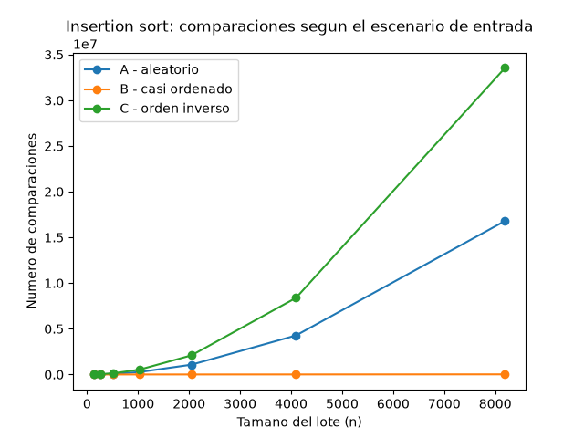
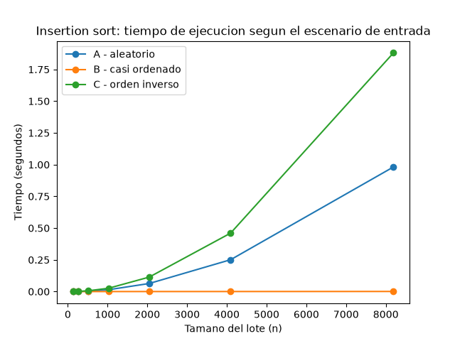
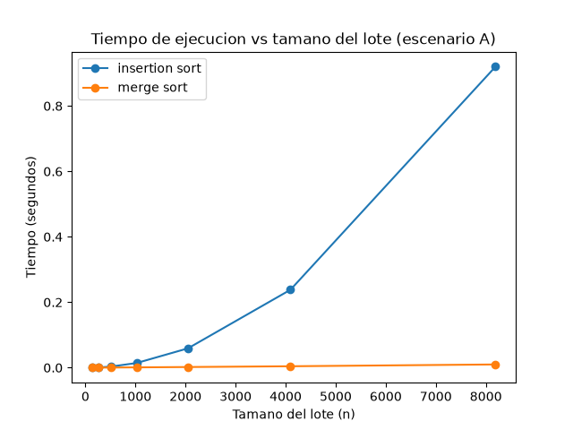

# Laboratorio evaluativo 1 — Fundamentos, complejidad y recurrencias

**Nombre:** John Sebastian Gomez

## Cómo correr esto

Con el entorno virtual de la raíz del repo ya activado (ver Laboratorio 2):

```bash
source venv/Scripts/activate      # o venv/bin/activate en Linux/Mac
pip install -r requirements.txt
cd lab1-fundamentos-complejidad-recurrencias
python parte3_casos.py
python parte4_complejidad.py
```

El primer script deja las gráficas `parte3_comparaciones.png` y `parte3_tiempo.png` en `graficas/`, y el segundo deja `parte4_tiempo.png`. En consola también quedan impresos los números que se citan más abajo.

---

## Parte 1 — Analizar el algoritmo antes de comprar hardware

Que insertion sort lleve ocho años funcionando bien en Tamiza confirma que es **correcto**: para cualquier lote que reciba, en algún momento termina y entrega la lista ordenada por riesgo. Pero eso no dice nada sobre si es una buena elección para este problema, porque corrección y eficiencia son dos cosas distintas — la eficiencia mide cuánto tarda (o cuánta memoria gasta) en llegar a ese resultado correcto, y acá la restricción concreta que se está incumpliendo es la ventana de 4 horas. Un algoritmo puede ser 100% correcto y aun así no servir si tarda más de lo que el sistema puede esperar.

Por qué duplicar la velocidad del servidor no arregla el problema de raíz: insertion sort tiene un costo que crece con el cuadrado del número de registros. Si el volumen de datos se duplicó al pasar de unos pocos laboratorios a los 340 de todo el departamento, el tiempo de ordenamiento no se duplicó también, se multiplicó por cuatro. Un servidor el doble de rápido solo divide ese tiempo entre dos, así que en el mejor de los casos deja el proceso donde estaba antes de la ampliación — y en cuanto la Secretaría vuelva a ampliar la cobertura (que es literalmente el objetivo del programa), va a tocar comprar hardware otra vez. Es un parche que hay que repetir cada vez que crece el volumen, mientras que cambiar a un algoritmo de orden n log n resuelve esto de fondo, sin depender de comprar más máquina cada dos años.

Otro ejemplo, bien distinto: una empresa de mensajería que cada madrugada arma las rutas de reparto ordenando los pedidos del día por franja horaria de entrega prometida. Si la empresa opera con 5.000 pedidos diarios en una ciudad y decide expandirse a diez ciudades, el volumen puede llegar a 50.000 pedidos, y si el algoritmo que arma esas rutas también es de los que escalan cuadrático, el tiempo de cómputo no crece 10 veces, crece 100 veces. La restricción que se rompe ahí no es "el servidor es viejo", es que el algoritmo elegido no aguanta el volumen que la empresa necesita procesar todas las mañanas antes de que salgan los repartidores.

---

## Parte 2 — Responsabilidad ambiental y ética

**Ambiental.** El tiempo que tarda el proceso de ordenamiento se traduce directo en consumo eléctrico del servidor, y esto no es un gasto aislado: corre todas las madrugadas, sin descanso, mientras la plataforma siga en producción. Si cambiar de insertion sort a un algoritmo más rápido ahorra, digamos, 20 minutos de cómputo por noche, ese ahorro se repite 365 veces al año y se acumula durante todos los años que Tamiza siga corriendo. Mantener un algoritmo ineficiente en un proceso que se repite todos los días no es un descuido menor, es una decisión que tiene un costo energético que se paga una y otra vez, indefinidamente.

**Ética.** Encuentro al menos dos perjuicios concretos, con alguien identificable detrás de cada uno:

1. El **operador del centro de llamadas**, que en las madrugadas donde el proceso no termina a tiempo probablemente tiene que trabajar con una lista incompleta o reprocesar algo a mano bajo presión, cargando con un problema que no generó él sino el software que le entregan.
2. El **equipo de desarrollo/soporte** de la plataforma, que es quien va a tener que explicar por qué la lista quedó incompleta cuando eso ya pasó tres veces, aunque la causa real sea una decisión de diseño de hace ocho años que nadie revisó a tiempo — el costo de la reputación técnica cae sobre quien mantiene el sistema hoy, no sobre quien lo escribió originalmente.

Y hay una tensión de fondo que vale la pena nombrar: el orden en que queda la lista decide, en la práctica, a quién se llama primero. Si el ordenamiento falla o queda incompleto, no es un error neutro como perder una fila en un reporte cualquiera — significa que alguien con más riesgo cardiovascular puede quedar más abajo en la fila que alguien con menos riesgo. Eso obliga a que el criterio de "funciona la mayoría de las veces" no sea suficiente acá: el ordenamiento tiene que ser exacto siempre, porque el orden de la lista es, de hecho, quién recibe la llamada primero.

---

## Parte 3 — Peor caso, mejor caso y caso promedio

### 3.1 Explicación

- **Peor caso**: el número máximo de comparaciones que hace el algoritmo, considerando todas las entradas posibles de un tamaño n dado. Es la respuesta a "¿qué tan mal se puede poner esto?".
- **Mejor caso**: el número mínimo de comparaciones, sobre ese mismo conjunto de entradas de tamaño n.
- **Caso promedio**: el promedio de comparaciones sobre todas las entradas de tamaño n, asumiendo que cualquiera de ellas es igual de probable de llegar.

Para decidir si el algoritmo puede entrar en producción usaría el **peor caso**, porque la ventana de 4 horas no da margen para "normalmente sí, a veces no". El canal de entrada de los registros puede cambiar (portal web, reproceso, migración) sin que el equipo de Tamiza lo controle, así que hay que garantizar que el proceso termine dentro del tiempo disponible sin importar cómo venga ordenado el lote esa noche. Diseñar pensando solo en el caso promedio deja abierta la posibilidad de que, justo la madrugada en que el lote venga en el peor orden posible, el sistema se quede corto — que es exactamente lo que ya pasó tres veces.

**Predicción antes de medir:** como insertion_sort arma la lista de mayor a menor riesgo, espero que el escenario C (que llega en orden ascendente, exactamente al revés) sea el peor caso, porque cada registro nuevo va a tener que recorrer toda la parte ya ubicada antes de encontrar su puesto. Espero que el escenario B (casi ordenado, con el mismo orden que necesita Tamiza salvo el 2% final) sea el mejor caso, porque casi no hay corrimientos que hacer. El escenario A, al ser aleatorio, debería quedar en un punto intermedio entre los dos anteriores.

### 3.2 Resultados

Código: [`parte3_casos.py`](parte3_casos.py), usando [`insertion_sort`](algoritmos.py) y los generadores de [`datos.py`](datos.py).





Con n=8192, insertion_sort necesitó 16.801.928 comparaciones en el escenario A, apenas 14.967 en el B y 33.550.336 en el C — el escenario B queda tan por debajo de los otros dos que en la gráfica de comparaciones su curva prácticamente se confunde con el eje horizontal. La predicción se cumplió en los siete tamaños que probé: C siempre resultó el peor, B siempre el mejor, y A quedó en el medio, más cerca del peor caso que del mejor (lo cual tiene sentido, porque en un lote aleatorio el número esperado de corrimientos por elemento es la mitad del tamaño ya ordenado, no cero como en B).

Algo que confirma que el conteo está bien hecho: con n=128 en el escenario C, salieron exactamente 8.128 comparaciones, que es 128×127/2, el valor que da la fórmula del peor caso teórico de insertion sort. Las curvas de tiempo siguen la misma forma que las de comparaciones, con algo de ruido en los tamaños chicos (128, 256) donde el tiempo medido es tan corto que la variabilidad del sistema pesa más.

---

## Parte 4 — Complejidad de merge sort e insertion sort

### 4.1 Cálculo teórico

**Recurrencia de merge sort.** `merge_sort` divide la lista en dos mitades, llama recursivamente sobre cada una y después las combina con `_combinar`, que recorre las dos mitades una sola vez (costo lineal). Esto da la recurrencia:

$$T(n) = 2T(n/2) + \Theta(n)$$

**Resolviéndola por el método maestro.** La recurrencia tiene la forma $T(n) = aT(n/b) + f(n)$ con:

- $a = 2$ (dos llamadas recursivas)
- $b = 2$ (cada llamada trabaja sobre la mitad del tamaño)
- $f(n) = \Theta(n)$ (costo de combinar las dos mitades)

Se calcula $n^{\log_b a} = n^{\log_2 2} = n^1 = n$, y se compara contra $f(n)$: como $f(n) = \Theta(n) = \Theta(n^{\log_b a})$, estamos exactamente en el **caso 2** del método maestro (el costo de combinar crece al mismo ritmo que $n^{\log_b a}$, ni más rápido ni más despacio). Verificando la condición del caso 2 explícitamente: $f(n) = \Theta(n^{\log_b a} \cdot \log^0 n) = \Theta(n)$, que es justo lo que tenemos. Por lo tanto:

$$T(n) = \Theta(n^{\log_b a} \cdot \log n) = \Theta(n \log n)$$

**Costo de insertion_sort, línea por línea.** Usando `t_i` como el número de veces que el `while` interno se ejecuta durante la iteración externa con índice `i` (de 1 a n-1), donde `t_i` puede valer entre 0 (el elemento ya está en su lugar) e `i` (hay que moverlo hasta el principio):

| Línea | Costo | Veces ejecutada |
|---|---|---|
| `for indice in range(1, n)` | c₁ | n |
| `valor = resultado[indice]` | c₂ | n − 1 |
| `posicion = indice` | c₃ | n − 1 |
| `while posicion > 0:` | c₄ | Σ(tᵢ + 1) |
| `comparaciones += 1` | c₅ | Σ tᵢ |
| `if resultado[posicion - 1] < valor:` | c₆ | Σ tᵢ |
| `resultado[posicion] = ...; posicion -= 1` | c₇ | Σ tᵢ' (tᵢ' ≤ tᵢ) |
| `resultado[posicion] = valor` | c₈ | n − 1 |

- **Mejor caso**: la lista ya llega en el orden que produce el algoritmo (de mayor a menor). `tᵢ = 0` para todo i, así que el costo total queda dominado por los términos que se ejecutan n o n−1 veces: T(n) = Θ(n).
- **Peor caso**: la lista llega en el orden exactamente contrario. `tᵢ = i` para todo i, y Σtᵢ = Σ_{i=1}^{n-1} i = n(n−1)/2, que es Θ(n²).
- **Caso promedio**: en un lote aleatorio, en promedio cada elemento nuevo se mueve la mitad de lo que lleva ordenado, entonces Σtᵢ ≈ n(n−1)/4 — sigue siendo Θ(n²), con una constante menor que en el peor caso.

**Tabla de complejidades:**

| Algoritmo | Mejor caso | Peor caso | Caso promedio |
|---|---|---|---|
| `insertion_sort` | Θ(n) | Θ(n²) | Θ(n²) |
| `merge_sort` | Θ(n log n) | Θ(n log n) | Θ(n log n) |

A diferencia de insertion sort, merge sort siempre parte el problema por la mitad sin importar el orden de entrada, así que no tiene esa variación entre mejor/peor caso: el costo depende solo de n, no de cómo vengan ordenados los datos.

### 4.2 Validación experimental

Código: [`parte4_complejidad.py`](parte4_complejidad.py), comparando [`insertion_sort` y `merge_sort`](algoritmos.py).



Con n=8192 sobre el escenario A, insertion_sort tardó en promedio 0,920 s y merge_sort 0,0099 s — casi 93 veces más rápido, y la diferencia se sigue ampliando a medida que n crece. En la gráfica se nota clarísimo: la curva de insertion_sort tiene la forma de parábola típica de Θ(n²), mientras que la de merge_sort se mantiene casi plana en esa misma escala, coherente con Θ(n log n). En mis mediciones merge sort ya ganó desde el tamaño más chico que probé (n=128: 0,000084 s contra 0,000162 s), no alcancé a ver el cruce donde insertion sort le gana a merge sort en entradas muy pequeñas que a veces se menciona en la teoría — probablemente porque ni 128 elementos es lo bastante chico para que el costo fijo de la recursión de merge sort pese más que su ventaja asintótica. De cualquier forma, esto es consistente con lo calculado en 4.1: insertion sort crece cuadrático, merge sort crece n log n, y esa diferencia de forma es justo lo que se ve en la gráfica.

### 4.3 Concepto técnico para el equipo de ingeniería de la Secretaría de Salud

Mi recomendación es reemplazar el ordenamiento de Tamiza por **merge sort**. No es solo por velocidad (que en mis pruebas fue de casi 93 veces más rápido con 8192 registros), sino porque su complejidad Θ(n log n) no cambia según cómo venga el lote. Insertion sort, en cambio, tuvo una diferencia de casi 2.250 veces en número de comparaciones entre su mejor y su peor caso con el mismo tamaño de entrada en mis pruebas. Como el canal por el que llegan los datos puede cambiar sin aviso, no es buena idea depender de un algoritmo tan sensible al orden de entrada, y tampoco tiene sentido mantener dos implementaciones (una para "cuando viene bien" y otra para "cuando viene mal") si hay una sola que se comporta bien en los tres escenarios.

Sobre si el proceso actual alcanza a correr en las 4 horas: con insertion_sort medí 0,920 s para 8192 registros en el escenario A. Escalando por el crecimiento cuadrático ((1.200.000/8192)² ≈ 21.480 al pasar a 1.200.000 registros), la estimación queda en unos 0,920 × 21.480 ≈ 19.760 s, es decir, alrededor de **5,5 horas** solo para ordenar — ya por encima del límite de 4 horas, sin contar el resto del proceso. **Aclaro que es una extrapolación desde mediciones en un computador de desarrollo, no una medición en el servidor real**, pero el orden de magnitud coincide con que la lista haya quedado incompleta en las últimas semanas. Con merge_sort, el crecimiento n log n da una proyección muy distinta: a partir de los 0,0099 s medidos en n=8192, el tiempo estimado para 1.200.000 registros queda en el orden de unos pocos segundos, muy por debajo de la ventana disponible.

Frente a la propuesta de comprar un servidor del doble de velocidad: eso divide entre dos un tiempo que, según la medición, ya está por encima de las 5 horas — seguiría sin caber en la ventana de 4. Cambiar el algoritmo resuelve el problema con el hardware que ya existe, sin depender de comprar máquina cada vez que el volumen vuelva a crecer.

Una consideración aparte del tiempo: `merge_sort`, tal como está implementado, es **estable** (cuando dos registros llegan con el mismo índice de riesgo, se conserva el orden en que llegaron), lo cual puede ser relevante si en el futuro se agrega un criterio de desempate por antigüedad del registro; insertion sort, implementado como está en producción hoy, no garantiza eso de la misma forma. También vale la pena tener en cuenta que merge sort necesita memoria adicional para las listas temporales de la mezcla, lo cual con 1.200.000 enteros es un costo manejable, pero conviene dimensionarlo antes de migrar a producción.
